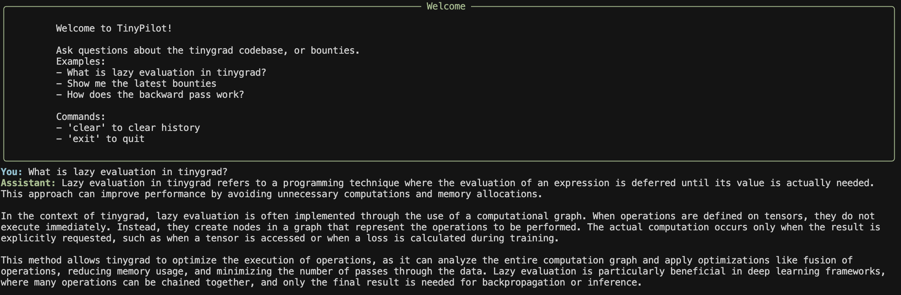

# tinypilot


Local agent that helps you learn [TinyGrad](https://github.com/tinygrad/tinygrad) and updates you on the bounties!

## Currently implemented:

### Retrieval
- Uses SentenceTransformer's "all-MiniLM-L6-v2" model for embeddings
- ChromaDB for vector storage and similarity search

### Generation 
- OpenAI's GPT model for response generation
- Combines retrieved documents with user query

### Indexing
- Indexes:
  - Tinygrad repo
  - Bounties
  - [mesozoic-egg tutorials](https://github.com/mesozoic-egg/tinygrad-notes)
- batch processing for efficient embedding generation

### UI
- Rich text-based terminal interface

### Chat History
- Queries and their answers logged to a SQLite database.
- This database is stored as `chat_history.db`

## Example



## Setup

1. Create and activate virtual env:
```bash
python -m venv venv
source venv/bin/activate  # On Windows: venv\Scripts\activate
```

2. Dependencies:
```bash
pip install -r requirements.txt
```

3. OpenAI API key:
```bash
# Create a .env file in the project root
echo "OPENAI_API_KEY=your-key-here" > .env
```

## Usage

### First Time Setup
Run the main script to update and index all data:
```bash
python main.py
```

This will:
1. Update the tinygrad repo
2. Update on bounties
3. Scrape tutorials
4. Index and embed all data for semantic search (patiently wait to finish)
5. Launch chat

### Daily Use
Once the data is indexed, you can start TinyPilot instantly using:
```bash
python tinypilot.py
```

This will:
1. Skip the data collection and indexing steps
2. Load the existing indexed data
3. Start the interface immediately

## Project Structure

### Backend
- Python-based RAG system
- Vector database and embeddings
- OpenAI integration
- Rich terminal UI

### Next update?


